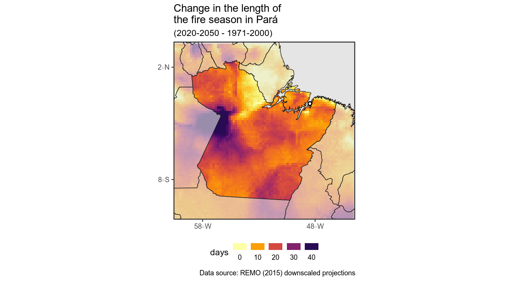
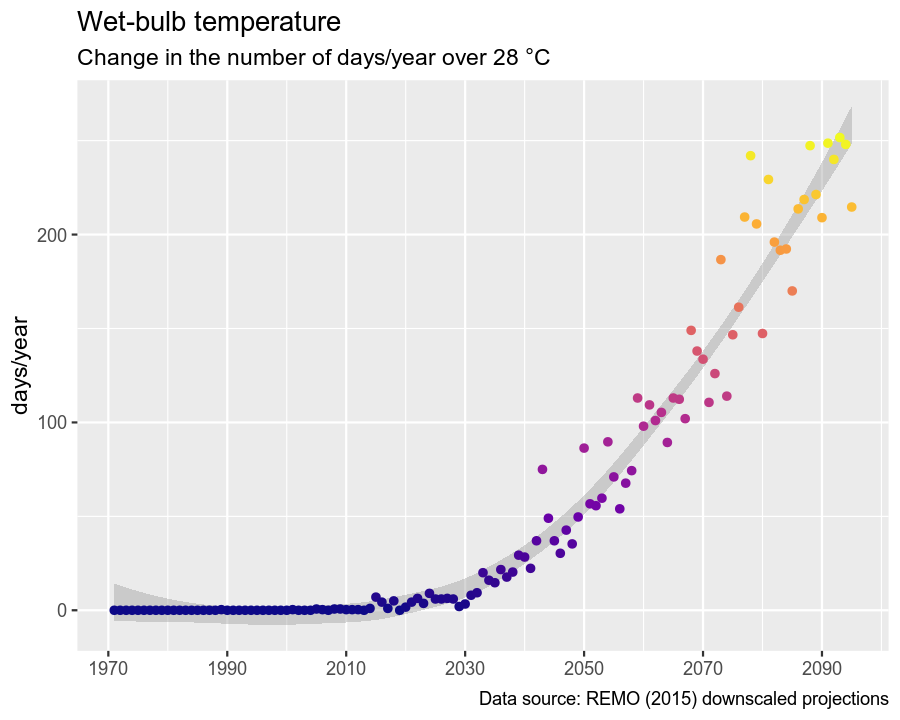

Belém
-----

------------------------------------------------------------------------

This figure shows future changes in the **standard deviation of monthly mean temperatures** (×100) relative to 1970-2000. Higher values indicate that the "spread" of temperatures within periods will increase over time (hot months will become hotter and cold months colder).

------------------------------------------------------------------------

 This figure shows future changes in **the difference between the highest maximum temp. and the lowest minimum temp. within a year** relative to 1970-2000. Higher values indicate that that difference will increase over time. The difference between this figure and the previous one is that this one considers extreme values (max and min temps) rather than the mean, and it analyzes those differences annually rather than by time period. But in a way it says a similar story: the hot months of the year will get hotter and cold months colder. If a choice needs to be made between this or the previous figure for the one-pager, I'd choose this one since it is easier to interpret.

------------------------------------------------------------------------

 This figure shows future changes in the **precipitation of the wettest month of a year** relative to 1970-2000. Higher values indicate that that the wettest month will become wetter over time. Notice that the ensemble of models project a reduction of precipitation until 2060-2080 (first three facets), and after that, an abrupt increase (last facet).

------------------------------------------------------------------------

 This figure shows future changes in the **precipitation of the driest month of a year** relative to 1970-2000. Higher values indicate that that the driest month will become drier over time.

------------------------------------------------------------------------

 This figure shows future changes in the **length of the fire season** in the surroundings of Belem relative to 1970-2000. Higher values indicate an increase (in days) of such length, and thus, more risk of wildfires. We think this figure is relevant as it suggests Belem's exposure to worsening air quality over time.

------------------------------------------------------------------------

 Same as above, but for the whole state of Pará.

------------------------------------------------------------------------

 This figure shows historical and future **frequency of days/year over 28 C of wet-bulb temperatures**. Wet-bulb temperature is a "feels-like" temperature indicator (strictly speaking, it is defined as the air temperature at 100% relative humidity). A wet-bulb temperature of 28 is considered dangerous for humans; continued exposure to it can lead to severe heat stress.
